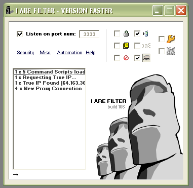



## I ARE FILTER \(aim proxy\)

### Description

An AIM/SOCKS4 proxy with tons of features. You'll have to excuse the sloppy code as I've been working on this project for over 6 months. Check the readme.txt file for information on using it with AIM. Please vote!
 
### More Info
 

             |
---                |---
**Submitted On**   |2004-04-08 19:42:56
**By**             |[Robbie Saunders](https://github.com/Planet-Source-Code/PSCIndex/blob/master/ByAuthor/robbie-saunders.md)
**Level**          |Advanced
**User Rating**    |4.7 (70 globes from 15 users)
**Compatibility**  |VB 6\.0
**Category**       |[Complete Applications](https://github.com/Planet-Source-Code/PSCIndex/blob/master/ByCategory/complete-applications__1-27.md)
**World**          |[Visual Basic](https://github.com/Planet-Source-Code/PSCIndex/blob/master/ByWorld/visual-basic.md)
**Archive File**   |[I\_ARE\_FILT173105482004\.zip](https://github.com/Planet-Source-Code/robbie-saunders-i-are-filter-aim-proxy__1-52994/archive/master.zip)

